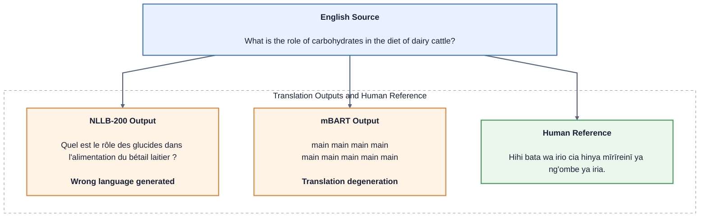

# Intuition

This Mermaid flowchart shows the English source above the three side-by-side translation outputs and human reference. The model observations appear beneath their respective outputs.

```mermaid
%%{init: {"theme":"base","flowchart":{"htmlLabels":true,"curve":"linear","nodeSpacing":70,"rankSpacing":70},"themeVariables":{"fontSize":"16px","primaryTextColor":"#172033","lineColor":"#596579"}}}%%
flowchart TB
    SOURCE["<div style='width:760px;text-align:center'><b>English Source</b><br/><br/>What is the role of carbohydrates in the diet of dairy cattle?</div>"]

    subgraph COMPARISON["Translation Outputs and Human Reference"]
        direction LR
        NLLB["<div style='width:320px;text-align:center'><b>NLLB-200 Output</b><br/><br/>Quel est le rôle des glucides dans l'alimentation du bétail laitier ?<br/><br/><span style='color:#b91c1c'><b>Wrong language generated</b></span></div>"]
        MBART["<div style='width:320px;text-align:center'><b>mBART Output</b><br/><br/>main main main main<br/>main main main main main<br/><br/><span style='color:#b91c1c'><b>Translation degeneration</b></span></div>"]
        HUMAN["<div style='width:320px;text-align:center'><b>Human Reference</b><br/><br/>Hihi bata wa irio cia hinya mīrīreinī ya ng'ombe ya iria.</div>"]
    end

    SOURCE --> NLLB
    SOURCE --> MBART
    SOURCE --> HUMAN

    classDef source fill:#e8f1ff,stroke:#4a78b5,color:#172033,stroke-width:2px;
    classDef model fill:#fff3e6,stroke:#d98a42,color:#172033,stroke-width:2px;
    classDef reference fill:#eaf7ed,stroke:#4d9b61,color:#172033,stroke-width:2px;

    class SOURCE source;
    class NLLB,MBART model;
    class HUMAN reference;
    style COMPARISON fill:transparent,stroke:#8a94a6,color:#172033,stroke-dasharray:5 5
    linkStyle default stroke:#596579,stroke-width:2px
```
